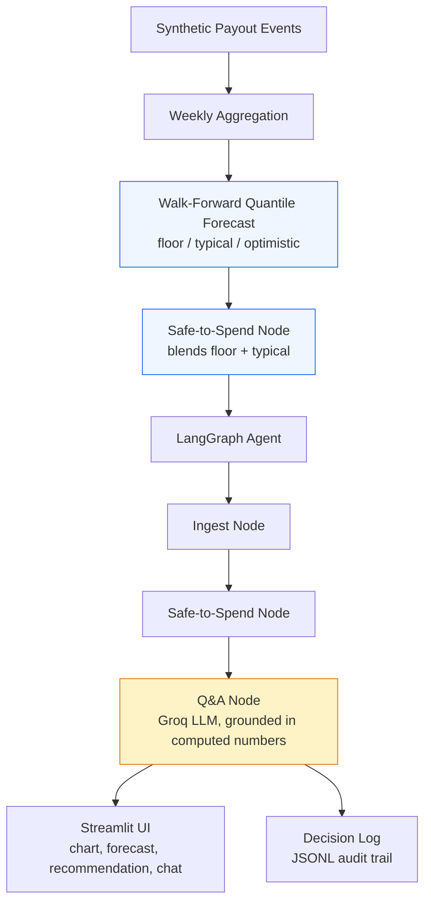

# Irregular-Income Budgeting Agent

A budgeting agent for gig workers and freelancers with volatile, irregular income.
It forecasts a realistic income range for the week ahead, recommends a safe-to-spend
amount grounded in that forecast, and answers natural-language budgeting questions —
explicitly flagging when it doesn't have enough history to be confident, rather than
guessing.

Built as a personal project (not a hackathon submission). Everything runs on
synthetic data — no real payment or payout data was used or is accessible to this
project.

## 1. Problem

Budgeting tools assume predictable, monthly income. Gig workers, delivery partners,
and freelancers don't have that — their income arrives in irregular bursts, with
genuine weeks of zero income mixed with high-earning weeks. Generic budgeting advice
("save 20% of income") doesn't translate when "income" isn't a stable number to begin
with.

## 2. Why naive approaches are insufficient

Two naive baselines were implemented and measured against, not just assumed to be weak:

- **Last-value baseline**: assume this week's income equals last week's
- **Flat-mean baseline**: assume this week's income equals the average of all prior weeks

Both ignore the _shape_ of a person's volatility entirely — a single bad week looks the
same to a flat-mean model whether it follows a run of good weeks or bad ones. Section 6
shows both were beaten by the method actually used here.

## 3. Approach

Rather than a single point forecast, the agent computes a **walk-forward empirical
quantile band**: for each week, it looks at a trailing 8-week window of past income and
computes the 10th percentile (floor / conservative case), 50th percentile (typical
case), and 90th percentile (optimistic case). Forecasts strictly only use weeks
_before_ the one being forecast — no lookahead.

A deliberate design decision, found through ablation (Section 5): the **floor can
honestly be ₹0** for a volatile income pattern with frequent zero-income weeks — that's
not a bug, it's an accurate reflection of real volatility. Because of this, the
safe-to-spend recommendation **blends the floor with the typical forecast** rather than
relying on the floor alone, so a legitimately-zero worst case doesn't zero out the
whole recommendation.

Below a minimum history threshold, the agent does not attempt a confident forecast at
all — it returns a wider, explicitly flagged low-confidence estimate instead of a
false-precision number.

## 4. Architecture



The LLM only explains the numbers in natural language — it never computes the
forecast or the recommendation itself. Those are deterministic, auditable functions
(blue boxes above), which is a repeated design choice throughout this project:
**anything that needs to be reproducible and explainable is plain code; the LLM
(amber box) is used only where language understanding is actually the task.**

### Tech stack

- **Python** — pandas, numpy for data generation and forecasting logic
- **LangGraph** — agent pipeline (state graph, 3 nodes)
- **Groq API** (`openai/gpt-oss-120b`) — grounded natural-language Q&A
- **Streamlit** — UI
- **pytest** — test suite
- **Git/GitHub** — version control

## 5. What was tried and ruled out (ablation)

A multi-week rolling horizon was initially tried to fix the ₹0-floor issue by widening
the window the quantiles are computed over. Ablation testing (sweeping horizon length
2–5 weeks and window size 6–12 weeks) showed this **worsened** calibration — coverage
dropped as low as 29%, because summing overlapping rolling windows makes consecutive
samples highly correlated, shrinking the effective sample size feeding the quantile
estimate.

A second ablation swept the floor's quantile directly (5th–25th percentile) on the
original single-week method. This showed the ₹0-floor issue barely moved across that
range, because the underlying zero-income-week _rate_ for a volatile persona (≈30%)
exceeds the percentile range being tested — no quantile choice alone fixes it.

**Conclusion, and what was actually implemented:** the zero floor is a correct forecast
output, not a bug to engineer away. The fix belongs at the safe-to-spend layer (blending
floor and typical), not the forecasting layer — see Section 3.

## 6. Results

Evaluated via walk-forward backtesting across 3 synthetic personas (steady, high-
volatility, and thin-history), and across 5 random seeds for the two personas with
sufficient data.

**Coverage** (% of actual weeks landing inside the predicted floor–optimistic band;
target ≈80% for a 10th–90th percentile band) and **pinball loss** (lower is better),
single-seed:

| Persona                 | Weeks evaluated | Coverage | Pinball loss |
| ----------------------- | --------------- | -------- | ------------ |
| steady_delivery_partner | 23              | 73.9%    | 1,960.93     |
| spiky_freelancer        | 21              | 76.2%    | 4,632.85     |
| new_gig_worker          | 2               | 100%\*   | 742.79       |

\*not statistically meaningful at n=2 — see Section 7.

**Multi-seed stability** (5 seeds), mean ± std:

| Persona                 | Coverage      | Pinball loss           |
| ----------------------- | ------------- | ---------------------- |
| steady_delivery_partner | 70.8% ± 7.1%  | 2,445.9 ± 361.0        |
| spiky_freelancer        | 76.5% ± 6.0%  | 5,678.4 ± 1,268.9      |
| new_gig_worker          | 53.3% ± 50.6% | not meaningful (n=1–3) |

Coverage is consistently a few points below the 80% target across both personas and
all seeds — stated plainly in Section 7, not hidden.

**Baseline comparison** (Mean Absolute Error of the point forecast vs. naive methods):

| Persona                 | Our method | Best naive baseline | Improvement |
| ----------------------- | ---------- | ------------------- | ----------- |
| steady_delivery_partner | 3,922      | 4,072 (flat-mean)   | +3.7%       |
| spiky_freelancer        | 9,266      | 11,739 (flat-mean)  | +21.1%      |
| new_gig_worker          | 1,486      | 4,661 (flat-mean)   | +68.1%\*    |

\*based on very few evaluated weeks; directionally consistent but not a reliable
point estimate.

## 7. Limitations

- **Synthetic data only.** All personas and income histories are generated, not real
  payout data — real gig-platform settlement data is not publicly accessible. The
  method is validated on controlled synthetic volatility, not messy real-world income.
- **Coverage runs slightly below target.** Consistently ~70–77% against an 80% target
  across seeds — likely the empirical quantile estimator being somewhat tight on
  8-week windows. Not corrected further in this version.
- **The `new_gig_worker` persona's accuracy metrics are not statistically meaningful**
  at its sample size (1–3 confident weeks per seed). It exists specifically to exercise
  the low-confidence fallback path, not to produce a trustworthy coverage number.
- **This is a working prototype, not a deployable product.** It has no real-data
  ingestion, no authentication, no persistence beyond a local JSONL log, and has not
  been evaluated against real financial behavior.

## 8. Running locally

```bash
python -m venv venv
./venv/Scripts/Activate.ps1      # Windows PowerShell
pip install -r requirements.txt  # or: pip install pandas numpy langgraph groq python-dotenv streamlit pytest

# Add your own Groq API key (free tier) to a .env file:
# GROQ_API_KEY=your_key_here

python generate_data.py          # generate synthetic personas
python forecast.py               # run walk-forward evaluation
python baseline_comparison.py    # compare against naive baselines
python multiseed_eval.py         # check coverage stability across seeds
pytest test_forecast.py -v       # run the test suite

streamlit run app.py             # launch the UI
```

## 9. Repository layout

```
generate_data.py        synthetic persona + payout event generation
forecast.py              walk-forward quantile forecasting, baselines, evaluation
agent.py                 LangGraph pipeline (ingest → safe-to-spend → Q&A), decision log
app.py                   Streamlit UI
ablation.py               horizon/window sensitivity sweep (ruled out — see Section 5)
ablation_floor.py         floor-quantile sensitivity sweep (ruled out — see Section 5)
multiseed_eval.py        multi-seed coverage stability check
baseline_comparison.py   naive baseline comparison
test_forecast.py          pytest suite
```
